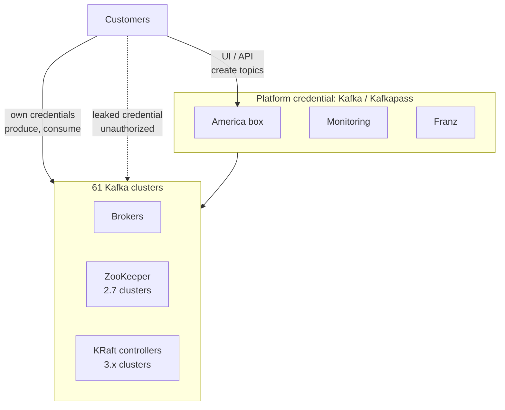
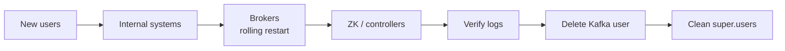

# Kafka credential rotation — project discovery

Sep 23, 2026 · @dolev nezer

## Problem statement

One shared credential (user `Kafka`, password `Kafkapass`) authenticates every component of the Kafka platform across 61 clusters. The credential has leaked, and customers use it to perform operations directly on the infrastructure.

The credential is used by:

- Brokers, ZooKeeper nodes and KRaft controllers on all 61 clusters
- The monitoring stack
- America box (infrastructure changes)
- Franz (infrastructure viewing)
- Customers who obtained it, bypassing their own credentials and America box

## Goals and scope

The goal is to retire the `Kafka` credential completely and replace it with separate, least-privilege identities per component.

In scope:

- All 61 clusters: brokers, ZooKeeper, KRaft controllers
- Monitoring, America box, Franz
- Cutting off customer access that uses the leaked credential

Out of scope: customer credentials. They are separate and stay as they are.

## Current state

Two credential sets exist. Customers have their own credentials: they create topics through the America box UI or API, and produce and consume with their own code. The shared `Kafka` / `Kafkapass` credential belongs to the platform: our services and the clusters' internal traffic.

The leak lets customers use the platform credential to act on the infrastructure directly, bypassing America box.



Internal cluster traffic (broker to broker, broker to ZooKeeper or controllers) also uses the platform credential.

### Credential storage

The platform credential is currently stored in three places, and the leak vector is unknown:

- Hardcoded in code and config files
- GitLab CI secrets
- OpenShift Secrets

## Known facts

| Fact | Implication |
| --- | --- |
| SASL mechanism is SCRAM-SHA-256 | Users are created and deleted live, no broker restart |
| Customers have their own credentials and create topics through America box | Customer credentials are unaffected by the rotation |
| Customer use of the platform credential is forbidden | Customers using it can be cut off without a migration period |
| Clusters run both Kafka 2.7 (ZooKeeper) and 3.x (KRaft) | Two execution paths for the internal links |
| 61 clusters share the platform credential | Rollout needs per-cluster automation |

## Target identity model (proposed)

One identity per component, each with only the permissions it needs.

| Identity | Used by | Permissions |
| --- | --- | --- |
| `kafka-broker` | Brokers (inter-broker) | Super user |
| `kafka-controller` | KRaft controllers | Super user |
| `zk-client` | Brokers to ZooKeeper | ZooKeeper only |
| `monitoring` | Exporters, alerting | Read-only (Describe) |
| `america-box` | America box | Admin (Create, Alter, Delete) |
| `franz` | Franz | Read-only (Describe) |

Open design choices: one password per cluster or one for all 61, and where secrets are stored.

## Approach

New identities are added alongside the old one, and the old credential is deleted only after every internal consumer has moved. Pilot on one test cluster of each type (2.7 and 3.x) first.

Per-cluster sequence:

1. Create the new SCRAM users (live, no restart).
2. Move monitoring, America box and Franz to their new users.
3. Rolling restart: brokers switch to `kafka-broker`; `super.users` holds both `User:Kafka` and `User:kafka-broker`.
4. Rotate the ZooKeeper and KRaft controller links (static config, rolling restart).
5. Check `kafka.authorizer.logger`: only customers remain on `Kafka`.
6. Delete the `Kafka` SCRAM credential. Customers are cut off. Rollback = re-create it.
7. Rolling restart: remove `User:Kafka` from `super.users`.



## Risks

| Risk | Impact | Mitigation |
| --- | --- | --- |
| Forgotten internal consumer still on `Kafka` | Outage at cutoff | Verify principals and source IPs in logs before step 6 |
| Deleting `Kafka` before brokers move | Whole cluster down | Enforce step order; brokers first |
| Changing the `Kafka` password in place | All consumers break at once | Never change it; create new users instead |
| `zookeeper.set.acl=true` with a renamed ZK user | Brokers locked out of metadata | Keep the ZK username, rotate the password only |
| SCRAM likely unsupported on the KRaft controller listener | Controller link needs a static mechanism | Verify `sasl.mechanism.controller.protocol` |
| New users not scoped by ACLs | New users also get full access | Verify `authorizer.class.name` and define ACLs per identity |
| Customer code produces or consumes with `Kafka` | Customer apps break at cutoff | Accepted: customer use is forbidden |
| Leak vector unknown | New credentials leak the same way | No hardcoded credentials; review read access to OpenShift namespaces and GitLab CI variables before issuing new ones |

## Open questions

- [ ] Is an authorizer configured (`authorizer.class.name`) on all clusters? Scoped customer credentials suggest yes.
- [ ] How many clusters run 2.7 (ZooKeeper) vs 3.x (KRaft), and which 3.x versions? SCRAM on KRaft requires 3.5 or later.
- [ ] Is `zookeeper.set.acl` enabled on the 2.7 clusters?
- [ ] Which mechanism does the KRaft controller listener use (`sasl.mechanism.controller.protocol`)?
- [ ] Is `User:Kafka` in `super.users`?
- [ ] Do America box and Franz hold one credential for all clusters, or one per cluster?
- [ ] One password per cluster, or one for all 61?
- [ ] Where will secrets be stored?
- [ ] Which automation tool reaches all 61 clusters?

## Reference commands

These work on Kafka 2.7 and 3.x via `--bootstrap-server`.

```bash
# create a user
kafka-configs.sh --bootstrap-server <broker>:<port> --command-config admin.properties \
  --alter --entity-type users --entity-name monitoring \
  --add-config 'SCRAM-SHA-256=[iterations=8192,password=<new-password>]'

# list users that have SCRAM credentials
kafka-configs.sh --bootstrap-server <broker>:<port> --command-config admin.properties \
  --describe --entity-type users

# cut off the old user (re-run the create command to roll back)
kafka-configs.sh --bootstrap-server <broker>:<port> --command-config admin.properties \
  --alter --entity-type users --entity-name Kafka \
  --delete-config 'SCRAM-SHA-256'

# inspect a broker's auth config
grep -E "sasl|super.users|set.acl|jaas|authorizer" /path/to/server.properties
```
