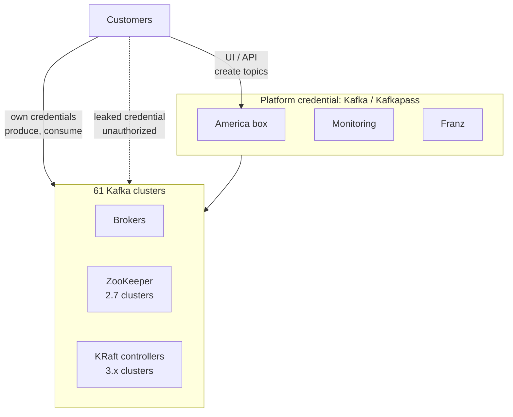
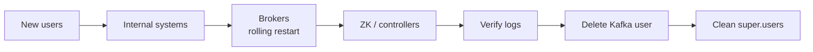

# Kafka credential rotation — project discovery

Sep 23, 2026 · @dolev nezer

## Problem statement

One shared credential (user `Kafka`, password `Kafkapass`) authenticates every component of the Kafka platform across 61 clusters. The credential has leaked, and customers use it to perform operations directly on the infrastructure.

The credential is used by:

- Brokers, ZooKeeper nodes and KRaft controllers on all 61 clusters
- The monitoring stack
- America box (infrastructure changes)
- Franz (infrastructure viewing)
- Customers who obtained it, bypassing their own credentials and America box

## Goals and scope

The goal is to retire the `Kafka` credential completely and replace it with separate, least-privilege identities per component.

In scope:

- All 61 clusters: brokers, ZooKeeper, KRaft controllers
- Monitoring, America box, Franz
- Cutting off customer access that uses the leaked credential

Out of scope: customer credentials. They are separate and stay as they are.

## Current state

Two credential sets exist. Customers have their own credentials: they create topics through the America box UI or API, and produce and consume with their own code. The shared `Kafka` / `Kafkapass` credential belongs to the platform: our services and the clusters' internal traffic.

The leak lets customers use the platform credential to act on the infrastructure directly, bypassing America box.



Internal cluster traffic (broker to broker, broker to ZooKeeper or controllers) also uses the platform credential.

### Credential storage

The platform credential is currently stored in three places, and the leak vector is unknown:

- Hardcoded in code and config files
- GitLab CI secrets
- OpenShift Secrets

### Finding hardcoded uses with Gitleaks

[Gitleaks](https://github.com/gitleaks/gitleaks) is a free, open-source tool that scans Git repositories for secrets, including the full commit history. It is a single binary with no network calls, so it runs in the air gap.

We use it twice:

1. **Before the rotation:** find every repo and config file that contains the platform credential. Each hit is a consumer that must move to a new identity before the old credential is deleted.
2. **After the rotation:** run it as a GitLab CI job and a pre-commit hook, so no new password is ever committed.

A custom rule catches the leaked password on top of the built-in rules:

```toml
# gitleaks.toml
[extend]
useDefault = true

[[rules]]
id = "kafka-platform-password"
description = "Leaked Kafka platform password"
regex = '''Kafkapass'''
```

Scan a repo, including its history, or a plain folder of config files:

```bash
gitleaks git --config gitleaks.toml --report-path kafka-leaks.json /path/to/repo
gitleaks dir --config gitleaks.toml /path/to/configs
```

The JSON report lists file, line, commit and author for each hit, which gives an owner per consumer.

Limits:

- Gitleaks only sees Git and files on disk. GitLab CI variables and OpenShift Secrets must be checked separately, through the GitLab API and `oc get secrets`.
- The old password stays in Git history. We don't need to rewrite history, because the password is deleted from Kafka at the end of the rotation.

## Known facts

| Fact | Implication |
| --- | --- |
| SASL mechanism is SCRAM-SHA-256 | Users are created and deleted live, no broker restart |
| Customers have their own credentials and create topics through America box | Customer credentials are unaffected by the rotation |
| Customer use of the platform credential is forbidden | Customers using it can be cut off without a migration period |
| Clusters run both Kafka 2.7 (ZooKeeper) and 3.x (KRaft) | Two execution paths for the internal links |
| 61 clusters share the platform credential | Rollout needs per-cluster automation |
| Ansible pipelines already reach all 61 clusters | Rotation steps become Ansible playbooks, run per cluster or in batches |

## Target identity model (proposed)

One identity per component, each with only the permissions it needs.

| Identity | Used by | Permissions |
| --- | --- | --- |
| `kafka-broker` | Brokers (inter-broker) | Super user |
| `kafka-controller` | KRaft controllers | Super user |
| `zk-client` | Brokers to ZooKeeper | ZooKeeper only |
| `monitoring` | Exporters, alerting | Read-only (Describe) |
| `america-box` | America box | Admin (Create, Alter, Delete) |
| `franz` | Franz | Read-only (Describe) |

### Open design choices

Two decisions are still open for the new identities.

#### 1. One password per cluster, or one for all 61?

The usernames above stay the same on every cluster. The question is whether each user gets the same password everywhere or a different password on each cluster.

**Option A: One password for all 61 clusters**

Each identity, for example `monitoring`, has one password that works on every cluster.

- Good: few secrets to manage, 6 in total. Simple for America box, Franz and monitoring, which each hold one password.
- Bad: one leak exposes all 61 clusters again. This is the same failure as today, only per identity instead of for everything.
- Bad: changing a password means changing it on all 61 clusters at once.

**Option B: Mixed**

Per-cluster passwords for the identities that only live inside a cluster: `kafka-broker`, plus `zk-client` on ZooKeeper clusters or `kafka-controller` on KRaft clusters. One shared password for the central services: `monitoring`, `america-box` and `franz`.

- Good: the powerful internal identities, which are super users, are limited to one cluster each. Central services stay simple.
- Bad: the central services still share one password across 61 clusters. `america-box` has admin rights, so a leak of its password is serious.

| Option | Secrets to manage | Impact of one leak | Effort |
| --- | --- | --- | --- |
| A. One for all | 6 | All 61 clusters | Low |
| B. Mixed | 2 × 61 + 3 = 125 | One cluster for internal identities, all clusters for central services | Medium |

Ruled out: a different password for every identity on every cluster (5 × 61 = 305 secrets). America box, Franz and monitoring would each have to hold 61 passwords and pick the right one per cluster, which is not practical.

#### 2. Where are the secrets stored?

See [Secret storage options](#secret-storage-options) under Open questions.

## Approach

New identities are added alongside the old one, and the old credential is deleted only after every internal consumer has moved. Pilot on one test cluster of each type (2.7 and 3.x) first.

Before any cluster work: run the Gitleaks scan across all repos and config folders, and check GitLab CI variables and OpenShift Secrets. This gives the list of internal consumers to move.

Per-cluster sequence:

1. Create the new SCRAM users (live, no restart).
2. Move monitoring, America box and Franz to their new users.
3. Rolling restart: brokers switch to `kafka-broker`; `super.users` holds both `User:Kafka` and `User:kafka-broker`.
4. Rotate the ZooKeeper and KRaft controller links (static config, rolling restart).
5. Check `kafka.authorizer.logger`: only customers remain on `Kafka`.
6. Delete the `Kafka` SCRAM credential. Customers are cut off. Rollback = re-create it.
7. Rolling restart: remove `User:Kafka` from `super.users`.



## Risks

| Risk | Impact | Mitigation |
| --- | --- | --- |
| Forgotten internal consumer still on `Kafka` | Outage at cutoff | Gitleaks scan up front to list consumers; verify principals and source IPs in logs before step 6 |
| Deleting `Kafka` before brokers move | Whole cluster down | Enforce step order; brokers first |
| Changing the `Kafka` password in place | All consumers break at once | Never change it; create new users instead |
| `zookeeper.set.acl=true` with a renamed ZK user | Brokers locked out of metadata | Keep the ZK username, rotate the password only |
| SCRAM likely unsupported on the KRaft controller listener | Controller link needs a static mechanism | Verify `sasl.mechanism.controller.protocol` |
| New users not scoped by ACLs | New users also get full access | Verify `authorizer.class.name` and define ACLs per identity |
| Customer code produces or consumes with `Kafka` | Customer apps break at cutoff | Accepted: customer use is forbidden |
| Leak vector unknown | New credentials leak the same way | No hardcoded credentials, enforced by Gitleaks in GitLab CI and pre-commit; review read access to OpenShift namespaces and GitLab CI variables before issuing new ones |

## Open questions

- [ ] Is an authorizer configured (`authorizer.class.name`) on all clusters? Scoped customer credentials suggest yes.
- [ ] How many clusters run 2.7 (ZooKeeper) vs 3.x (KRaft), and which 3.x versions? SCRAM on KRaft requires 3.5 or later.
- [ ] Is `zookeeper.set.acl` enabled on the 2.7 clusters?
- [ ] Which mechanism does the KRaft controller listener use (`sasl.mechanism.controller.protocol`)?
- [ ] Is `User:Kafka` in `super.users`?
- [ ] Do America box and Franz hold one credential for all clusters, or one per cluster?
- [ ] One password per cluster, or one for all 61?
- [ ] Are the current credential managers (GitLab CI secrets, OpenShift Secrets) enough, or should we adopt another option? See [Secret storage options](#secret-storage-options).

### Secret storage options

**The question:** after we create the new passwords, where do we keep them? Today the platform password sits in three places: in code, in GitLab CI secrets, and in OpenShift Secrets. We don't know which one leaked. If we put the new passwords in the same places, they may leak the same way.

**The constraint:** we are air-gapped. Every option must run inside our network, with no internet access. Cloud services like AWS Secrets Manager are out.

#### Option 1: Keep what we have, but lock it down

Keep using GitLab CI secrets and OpenShift Secrets. Remove the passwords from code, and tighten who can read them.

- Good: nothing new to install. Fastest option.
- Bad: passwords still live in two places. Hard to see who read a password. Changing passwords stays a manual job.
- Note: OpenShift Secrets are not encrypted by default, only encoded. Encryption must be turned on in the cluster.

#### Option 2: One central password vault (HashiCorp Vault or OpenBao)

Install a dedicated secrets server inside our network. All passwords live there. Services and pipelines ask it for passwords when they need them.

- Good: one place for all passwords. Logs every read, so we can see who accessed what. Fine-grained permissions per service.
- Bad: a new system to install, operate and back up.
- Air gap: works offline. OpenBao is the free, open-source version of Vault, so it needs no license.

#### Option 3: Central vault + automatic sync to OpenShift (External Secrets Operator)

An add-on to option 2. A small OpenShift component copies passwords from the vault into OpenShift Secrets automatically. Our apps don't need to change: they keep reading OpenShift Secrets as they do today.

- Good: apps stay the same. When a password changes in the vault, OpenShift gets the new one automatically.
- Bad: requires option 2 first.
- Air gap: works offline once its image is copied to our internal registry.

#### Option 4: Encrypted passwords in Git (Sealed Secrets)

Store passwords in Git, encrypted. Only the OpenShift cluster can decrypt them.

- Good: simple. Nothing readable in the repo.
- Bad: no logs of who read what, and no help with changing passwords. Protects Git only.
- Air gap: works offline.

#### Option 5: Certificates instead of passwords (mTLS)

Stop using passwords altogether. Each service proves its identity with a certificate that expires and renews automatically.

- Good: no password to leak.
- Bad: the biggest change. Every cluster and every service must be reconfigured. Better suited to a later project.
- Air gap: works offline with our own internal certificate authority.

#### Summary

| Option | Effort | Protects against another leak | Logs who read a password |
| --- | --- | --- | --- |
| 1. Lock down current stores | Low | Partly | No |
| 2. Central vault | Medium | Yes | Yes |
| 3. Vault + OpenShift sync | Medium | Yes | Yes |
| 4. Encrypted in Git | Low | Partly | No |
| 5. Certificates | High | Yes, best | Depends on setup |


