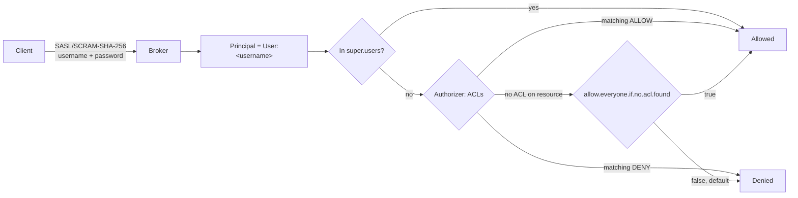

# Kafka roles for SCRAM-SHA-256 identities

Oct 4, 2026 · reference for the Kafka credential rotation project

## TL;DR

- **Apache Kafka has no built-in roles.** SCRAM only answers *who you are* (`User:<username>`). *What you may do* comes from **ACLs** evaluated by the authorizer, plus the static **`super.users`** list that bypasses ACLs.
- A "role" in this project is therefore a **named set of ACLs** we apply to a SCRAM user with a script. This document defines those sets.
- There are no groups of principals out of the box, so each identity gets its own ACLs. Keep the role templates in code and apply them per cluster.
- The rules are the same on 2.7 and 3.x, with a handful of differences listed in [Version differences](#version-differences-27-zookeeper-vs-3x-kraft). The biggest one: 2.7 producers need `IdempotentWrite` on the cluster, 3.x brokers don't.
- **Assumption:** the clusters run Apache Kafka, not Confluent Platform. Confluent RBAC roles are covered briefly at the end as not applicable.

## How authorization works



| Piece | 2.7 (ZooKeeper) | 3.x (KRaft) |
| --- | --- | --- |
| Authenticator | SCRAM-SHA-256, credentials stored in ZooKeeper | SCRAM-SHA-256, credentials stored in the metadata log (3.5+) |
| Authorizer class | `kafka.security.authorizer.AclAuthorizer` | `org.apache.kafka.metadata.authorizer.StandardAuthorizer` |
| Where ACLs live | ZooKeeper | KRaft metadata log |
| Super users | `super.users` in `server.properties` (static, restart to change) | Same, and must be set on brokers **and** controllers |

An ACL is: **principal + permission (Allow/Deny) + operation + resource + pattern + host**.

### Resource types

| Resource | What it covers | Notes |
| --- | --- | --- |
| `Topic` | A topic's data and metadata | |
| `Group` | A consumer group (also Streams/Connect groups) | |
| `Cluster` | Cluster-wide operations (`kafka-cluster`) | Admin-level power lives here |
| `TransactionalId` | A transactional producer's `transactional.id` | |
| `DelegationToken` | Delegation tokens | KRaft support from 3.6 |
| `User` | Creating/describing tokens for other users | 3.3+ only (KIP-373) |

### Operations

`Read`, `Write`, `Create`, `Delete`, `Alter`, `Describe`, `DescribeConfigs`, `AlterConfigs`, `ClusterAction`, `IdempotentWrite`, `CreateTokens`, `DescribeTokens`, `All`.

Implied permissions: `Read`, `Write`, `Delete` or `Alter` on a resource imply `Describe`; `AlterConfigs` implies `DescribeConfigs`. A `Deny` always wins over an `Allow`.

### Pattern types

| Pattern | Example | Use for |
| --- | --- | --- |
| `literal` | topic `orders` | One exact resource |
| `prefixed` | topic `orders.` | Everything starting with a prefix (team or app namespaces) |
| `literal` `*` | topic `*` | Every resource of that type (read-only roles) |

## The roles

Each role lists the ACLs to grant. `<P>` is the principal, for example `User:monitoring`.

### 1. Super user (inter-broker, KRaft controller)

Bypasses all ACLs. Reserve for the cluster's own processes.

| Grant | |
| --- | --- |
| `super.users=User:kafka-broker;User:kafka-controller` | Static config on every broker and controller, rolling restart to change |

- Minimum ACL alternative for brokers is `ClusterAction` on `Cluster` (replication fetches, controller requests), but super user is the norm and avoids surprises.
- On KRaft, the authorizer only allows super users until the metadata log is loaded, so broker and controller principals **must** be super users or startup hangs.
- **Project identities:** `kafka-broker`, `kafka-controller`.

### 2. Producer

| Resource | Pattern | Operations |
| --- | --- | --- |
| Topic | literal or prefixed | `Write` (implies `Describe`) |
| Topic | same | `Create` *(only if the app auto-creates topics)* |
| Cluster | | `IdempotentWrite` *(2.7 brokers only, see below)* |

- 3.x clients enable idempotence by default. Against a **2.7** broker, that needs `IdempotentWrite` on `Cluster`, or the producer fails with `ClusterAuthorizationException`. On 3.x brokers `Write` on any topic is enough (KIP-679).

### 3. Transactional producer (exactly-once)

Everything in **Producer**, plus:

| Resource | Pattern | Operations |
| --- | --- | --- |
| TransactionalId | literal or prefixed (`transactional.id`) | `Write`, `Describe` |
| Group | consumer group used in `sendOffsetsToTransaction` | `Read` |

### 4. Consumer

| Resource | Pattern | Operations |
| --- | --- | --- |
| Topic | literal or prefixed | `Read` (implies `Describe`) |
| Group | literal or prefixed (`group.id`) | `Read` |

- A consumer using `assign()` with no group needs only the topic `Read`.
- Resetting its own offsets with `kafka-consumer-groups` also needs `Read` on the group; deleting the group needs `Delete` on it.

### 5. Kafka Streams application

Prefix everything with `application.id` and grant:

| Resource | Pattern | Operations |
| --- | --- | --- |
| Topic (inputs) | literal/prefixed | `Read` |
| Topic (outputs) | literal/prefixed | `Write` |
| Topic (internal changelog/repartition) | prefixed `<application.id>` | `All` (needs `Create`, `Delete`, `Read`, `Write`, `DescribeConfigs`) |
| Group | literal `<application.id>` | `Read` |
| TransactionalId | prefixed `<application.id>` | `Write`, `Describe` *(exactly-once only)* |
| Cluster | | `IdempotentWrite` *(2.7 brokers only)* |

### 6. Kafka Connect worker

| Resource | Pattern | Operations |
| --- | --- | --- |
| Group | literal `<group.id>` of the worker | `Read` |
| Topic | config, offset and status topics | `Read`, `Write`, `Describe`, plus `Create` if Connect creates them |
| Topic | data topics of source connectors | `Write` |
| Topic | data topics of sink connectors | `Read` |
| Group | prefixed `connect-` (sink connector groups) | `Read` |
| Cluster | | `Describe`; `IdempotentWrite` on 2.7 |
| TransactionalId | prefixed per worker/connector | `Write`, `Describe` *(exactly-once source, 3.3+ only)* |

### 7. Read-only metadata (monitoring, dashboards)

Sees the shape of the cluster and lag, **not message contents**.

| Resource | Pattern | Operations |
| --- | --- | --- |
| Cluster | | `Describe`, `DescribeConfigs` |
| Topic | literal `*` | `Describe`, `DescribeConfigs` |
| Group | literal `*` | `Describe` |
| TransactionalId | literal `*` | `Describe` *(optional, for transaction monitoring)* |

- Covers lag exporters (offsets, group membership) and topic/partition metrics fetched through the Admin API.
- **JMX metrics don't go through Kafka auth at all.** A JMX exporter running beside the broker doesn't need a SCRAM user; only tools that connect over the Kafka protocol do.
- **Project identities:** `monitoring`, `franz` (if Franz only views metadata).

### 8. Read-only data viewer

**Read-only metadata** plus:

| Resource | Pattern | Operations |
| --- | --- | --- |
| Topic | literal `*` or prefixed | `Read` |
| Group | prefixed (the UI's own group, if it uses one) | `Read` |

- `Read` exposes message payloads, including customer data. Grant it only if Franz must show messages, and prefer a prefix over `*`.

### 9. Topic administrator

Manages topics and groups but not security.

| Resource | Pattern | Operations |
| --- | --- | --- |
| Cluster | | `Create` (create any topic), `Describe`, `DescribeConfigs` |
| Topic | literal `*` or prefixed | `Create`, `Delete`, `Alter`, `AlterConfigs`, `Describe`, `DescribeConfigs` |
| Group | literal `*` or prefixed | `Describe`, `Delete`, `Read` (offset resets) |

- `Create` on a topic prefix instead of on `Cluster` lets the admin create topics only inside that namespace.

### 10. Cluster operator

**Topic administrator** plus cluster-level operations:

| Need | Grant |
| --- | --- |
| Change dynamic broker configs | `AlterConfigs` on Cluster |
| Partition reassignment, preferred leader election | `Alter` on Cluster |
| Set client quotas | `AlterConfigs` on Cluster |
| Read quotas | `DescribeConfigs` on Cluster |

### 11. Security administrator

Manages users and permissions. **Effectively a super user**, because it can grant itself anything.

| Need | Grant |
| --- | --- |
| Create and delete ACLs | `Alter` on Cluster |
| List ACLs | `Describe` on Cluster |
| Create, change and delete SCRAM users (`AlterUserScramCredentials`) | `Alter` on Cluster |
| List SCRAM users (`DescribeUserScramCredentials`) | `Describe` on Cluster |
| Create tokens for other users | `CreateTokens` on User *(3.3+)* |

- **Project identity:** `america-box`, but only if it creates customer credentials or ACLs. If it only creates topics, use **Topic administrator** and keep `Alter` on Cluster off it.

### 12. ZooKeeper client (2.7 only)

Not a Kafka ACL role. Brokers log in to ZooKeeper with a separate SASL DIGEST-MD5 user from the `Client` section of the JAAS file.

- With `zookeeper.set.acl=true`, Kafka sets ZooKeeper znode ACLs to that principal, so **keep the username and rotate only the password**.
- **Project identity:** `zk-client`.

## Mapping to this project's identities

| Identity | Role | Notes |
| --- | --- | --- |
| `kafka-broker` | 1. Super user | In `super.users` on brokers (and controllers on KRaft) |
| `kafka-controller` | 1. Super user | KRaft only; controller listener usually PLAIN, since SCRAM isn't supported controller-to-controller |
| `zk-client` | 12. ZooKeeper client | 2.7 only |
| `monitoring` | 7. Read-only metadata | Not needed for JMX-only exporters |
| `franz` | 7. Read-only metadata, or 8 if it shows messages | Decide whether Franz needs message contents |
| `america-box` | 9. Topic administrator, plus 11 only if it manages customer users/ACLs | 11 is super-user-equivalent, so it should be stored like one |

Customer identities keep their current ACLs and are out of scope.

## Example commands

These use `--bootstrap-server`, which works on 2.7 and 3.x. The `admin.properties` file must authenticate as a principal with role 11 or a super user.

```bash
BS=<broker>:<port>
ADM="--bootstrap-server $BS --command-config admin.properties"

# Role 7: read-only metadata for monitoring
kafka-acls.sh $ADM --add --allow-principal User:monitoring \
  --operation Describe --operation DescribeConfigs --cluster
kafka-acls.sh $ADM --add --allow-principal User:monitoring \
  --operation Describe --operation DescribeConfigs --topic '*'
kafka-acls.sh $ADM --add --allow-principal User:monitoring \
  --operation Describe --group '*'

# Role 9: topic administrator for america-box
kafka-acls.sh $ADM --add --allow-principal User:america-box \
  --operation Create --operation Describe --operation DescribeConfigs --cluster
kafka-acls.sh $ADM --add --allow-principal User:america-box \
  --operation Create --operation Delete --operation Alter \
  --operation AlterConfigs --operation Describe --operation DescribeConfigs --topic '*'
kafka-acls.sh $ADM --add --allow-principal User:america-box \
  --operation Describe --operation Delete --operation Read --group '*'

# Role 2: producer on a topic prefix (add IdempotentWrite on 2.7)
kafka-acls.sh $ADM --add --allow-principal User:app1 --producer \
  --topic orders. --resource-pattern-type prefixed
kafka-acls.sh $ADM --add --allow-principal User:app1 \
  --operation IdempotentWrite --cluster          # 2.7 brokers only

# Role 4: consumer on a topic prefix and group prefix
kafka-acls.sh $ADM --add --allow-principal User:app1 --consumer \
  --topic orders. --group app1- --resource-pattern-type prefixed

# Review what a principal has
kafka-acls.sh $ADM --list --principal User:monitoring
```

`--producer` is a shortcut for `Write`, `Describe` and `Create` on the topic (`Create` makes it slightly broader than role 2). `--consumer` is a shortcut for `Read` and `Describe` on the topic and `Read` on the group.

## Version differences: 2.7 (ZooKeeper) vs 3.x (KRaft)

| Topic | 2.7 / ZooKeeper | 3.x / KRaft |
| --- | --- | --- |
| SCRAM credential storage | ZooKeeper | Metadata log, **3.5+ only** (KIP-900) |
| Authorizer | `AclAuthorizer` | `StandardAuthorizer` |
| ACL storage | ZooKeeper | Metadata log |
| Idempotent producers | Need `IdempotentWrite` on Cluster | `Write` on any topic is enough (KIP-679, 3.0+) |
| `User` resource type (`CreateTokens`, `DescribeTokens`) | Not available | 3.3+ |
| Exactly-once Connect source | Not available | 3.3+ (KIP-618), needs `TransactionalId` ACLs |
| Delegation tokens | Supported | KRaft support from 3.6 |
| `kafka-acls --authorizer-properties zookeeper.connect=...` | Works (deprecated) | Not available; use `--bootstrap-server` |
| Super user requirement | Brokers | Brokers and controllers; required before metadata loads |
| Internal metadata link | Broker to ZooKeeper (ZK SASL user) | Broker to controller (controller listener, usually PLAIN) |

ACLs don't copy between a ZooKeeper cluster and a KRaft cluster. Each cluster's ACLs are created on that cluster.

## Safety checks before granting roles

- **`allow.everyone.if.no.acl.found`** must be `false` (the default). If it's `true`, any new SCRAM user can reach every resource that has no ACLs.
- **`authorizer.class.name`** must be set. Without an authorizer, every authenticated user, including new ones, has full access.
- **Avoid `All` on `Cluster`** for anything except deliberate admin identities. `Alter` on Cluster can create ACLs and users, so it can escalate to anything.
- **Deny ACLs** can fence off sensitive topics even from broad roles, for example `--deny-principal User:franz --operation Read --topic internal. --resource-pattern-type prefixed`.
- **Audit** with `kafka-acls --list` per principal after applying a role, and watch `kafka.authorizer.logger` for `DENIED` entries during rollout.

## Confluent RBAC (not applicable)

Confluent Platform adds predefined roles through its Metadata Service: `SystemAdmin`, `ClusterAdmin`, `UserAdmin`, `SecurityAdmin`, `AuditAdmin`, `Operator`, `ResourceOwner`, `DeveloperManage`, `DeveloperRead`, `DeveloperWrite`. These only exist on Confluent Platform or Confluent Cloud. If the clusters are plain Apache Kafka, which this document assumes, they're unavailable, and the ACL roles above are the equivalent.

## Sources

- Apache Kafka docs, *Authorization and ACLs* and *Operations and Resources on Protocols* (kafka.apache.org/documentation/#security_authz)
- KIP-554 (SCRAM via Admin API, 2.7), KIP-679 (idempotence by default, 3.0), KIP-373 (`User` resource, 3.3), KIP-618 (exactly-once Connect source, 3.3), KIP-900 (SCRAM in KRaft, 3.5)
- Project discovery doc and the "Kafka 2.7 vs 3.x rotation" thread in this project
